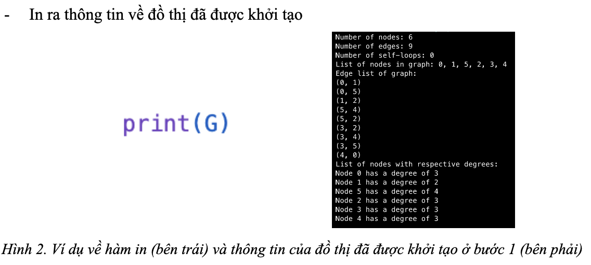
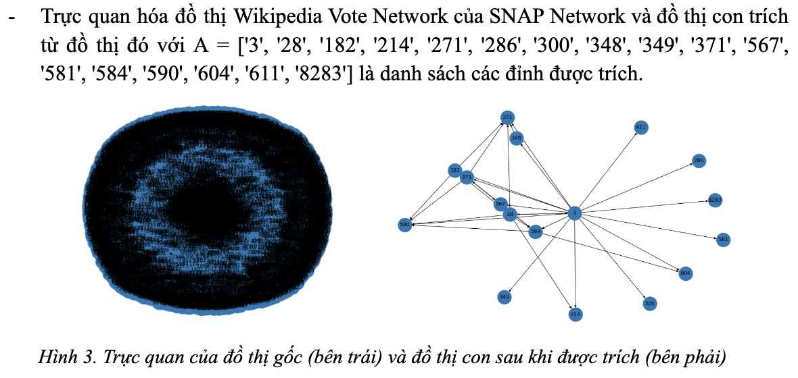

<div align='center'>

## Công Cụ Biểu Diễn Đồ Thị Lớn và Trích Đồ Thị Con

</div>

### Mục lục
#### 1. [Cài đặt](#1-cài-đặt)
#### 2. [Danh sách API](#2-danh-sách-các-api-của-ứng-dụng)
##### 2.1. [Các phương thức khởi tạo và chỉnh sửa đồ thị](#21-các-phương-thức-khởi-tạo-và-chỉnh-sửa-đồ-thị)
##### 2.2. [Các phương thức cung cấp thông tin và trực quan hóa đồ thị](#22-các-phương-thức-cung-cấp-thông-tin-và-trực-quan-hóa-đồ-thị)
#### 3. [Các ví dụ về use cases](#3-các-ví-dụ-về-use-cases)
#### 4. [Tài liệu tham khảo](#4-tài-liệu-tham-khảo)

---

### 1. Cài đặt
```bash
conda env create -f environment.yml
pip install -r requirements.txt
```

### 2. Danh sách các API của ứng dụng
#### 2.1. Các phương thức khởi tạo và chỉnh sửa đồ thị

<div align='center'>


</div>

#### 2.2. Các phương thức cung cấp thông tin và trực quan hóa đồ thị

<div align='center'>


</div>

### 3. Các ví dụ về use cases

<div align='center'>



</div>

<div align='center'>



</div>


### 4. Tài liệu tham khảo
[1]  Hagberg, A., Swart, P., & S Chult, D. (2008). *Exploring network structure, dynamics, and function using NetworkX*.     

[2]  Leskovec, J. & Krevl, A. (2014). *Snap Datasets: Stanford Large Network Dataset Collection*. Truy cập ngày 27/01/2023 tại [http://snap.stanford.edu/data](http://snap.stanford.edu/data)
